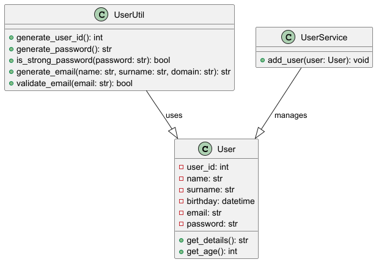

# User Management System

This project implements a user management system using object-oriented programming in Python. It includes three main classes: User, UserService, and UserUtil, along with unit tests.

## Features
- Create a user with unique attributes
- Store and manage users in a dictionary
- Generate secure passwords and validate emails
- Perform CRUD operations on users

## Installation
Ensure you have Python installed, then clone this repository and run the scripts:
python main.py

## Example Usage

from datetime import datetime
from user import User
from user_service import UserService
from user_util import UserUtil

# Creating a user with provided details
user = User(
    user_id=230102005,
    name="Nazik",
    surname="Abdrakhmanova",
    birthday=datetime.strptime("2005-11-05", "%Y-%m-%d")
)

# Generating email and password
generated_email = UserUtil.generate_email(user.name, user.surname, "example.com")
generated_password = UserUtil.generate_password()

# Assigning email and password to user
user.email = generated_email
user.password = generated_password

# Adding user to the service
UserService.add_user(user)

# Retrieving user details
print(user.get_details())
print(f"Age: {user.get_age()}")
print(f"Generated Email: {generated_email}")
print(f"Generated Password: {generated_password}")
print(f"Total Users: {UserService.get_number()}")

## Output
User ID: 230102005
Name: Nazik Abdrakhmanova
Email: nazik.abdrakhmanova@example.com
Birthday: 2005-11-05
Age: 18
Generated Email: nazik.abdrakhmanova@example.com
Generated Password: P@ssw0rdExample
Total Users: 1

## Running Unit Tests
Run the following command to execute the test cases:
python -m unittest discover tests

## UML Class Diagram

